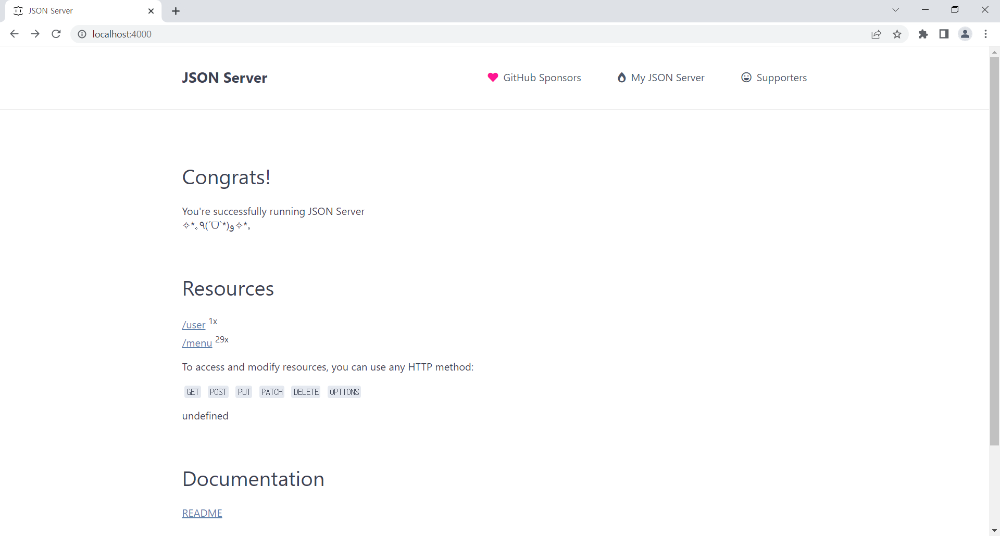
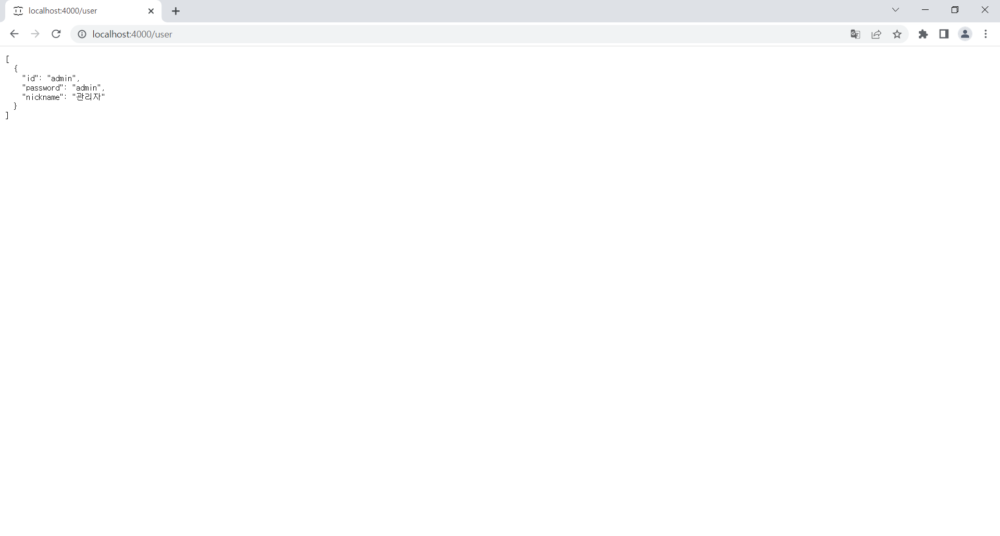
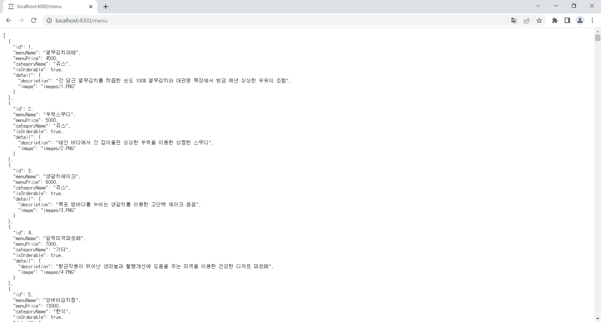

# React Redux CRUD 프로젝트

## 1. json-server
### 1-1. json-server 설치
```
npm install json-server
```

### 1-2. json-server 실행을 위한 프로젝트 설정
- 프로젝트 내부에 `/mock` 이라는 경로를 생성하고, 내부에 `db.json` 파일을 새로 생성한다.
- 좌측 폴더 브라우저에서 `/mock` 경로 우클릭 후 `통합 터미널에서 열기(Open in Integrated Terminal)`를 선택해 터미널 창을 하나 더 열어준다.

```
## 1. 현재 경로 확인
$ pwd

Path
----
C:\myWs\99_React.js\06_redux\04_redux-project-structure2\mock
```
```
## 2. 현재 경로에 db.json 파일이 존재하는지 확인
$ ls

디렉터리: C:\myWs\99_React.js\06_redux\04_redux-project-structure2\mock


Mode                 LastWriteTime         Length Name
----                 -------------         ------ ----
-a----      2024-09-01  오전 10:33           7492 db.json
```
```
## 3. db.json 파일이 존재하는 경로에서 json-server 실행
$ npx json-server ./db.json --port 4000
```

- 가상의 데이터 서버의 역할을 할 수 있는 json-server를 `db.json` 파일을 이용해 4000번 포트 위에서 동작시킨다.

- 브라우저에서 `http://localhost:4000/user`로 URL 요청을 통해 구동 확인한다. 



- 객체의 키 값(user)으로 요청할 수 있다. 



- 객체의 키 값(menu)으로 요청할 수 있다. 



- 자동으로 id 속성을 사용해서 다뤄지기 때문에 객체가 반드시 id 속성을 갖도록 한다.

## 2. 추가 라이브러리 설치

라우팅을 위한 react-router-dom 라이브러리와 전역 상태 관리, 미들 웨어 사용을 위한 redux 관련 라이브러리를 추가 설치한다. 

```
npm install react-router-dom
npm install redux
npm install react-redux
npm install redux-actions
npm install redux-thunk
npm install redux-logger
npm install redux-devtools-extension
```

### axios

API 요청을 보내기 위해 사용할 axios 라이브러리를 설치한다. 

```
npm install axios
```

```
// example
import axios from 'axios';

const DOMAIN = 'http://localhost:4000';

export const request = async (method, url, data) => {
	return await axios({
		method,
		url : `${DOMAIN}${url}`,
		data
	})
	  .then(res => res.data)
	  .catch(error => console.log(error));
};
```

- method
  - GET (Read) :
    - `/menu` - 전체 메뉴 조회
    - `/menu/1` - 1번 메뉴 조회
  - POST (Create) : `/menu` - 메뉴 등록
  - PUT (Update) : `/menu/1` - 1번 메뉴 수정
  - DELETE (Delete) : `/menu/1` - 1번 메뉴 삭제

- POST 요청과 PUT 요청의 차이
  - POST 요청은 새로운 리소스를 생성하거나, 이미 존재하는 리소스를 수정(덮어쓰기)하는 데 사용된다.
  - PUT 요청은 이미 존재하는 리소스를 수정하는 데 사용된다.
  - 수정의 관점에서...
    - POST는 어차피 새로운 리소스를 덮어쓰기 때문에 식별자를 지정할 필요가 없다.
    - PUT은 특정 리소스를 수정하는 것이기 때문에 식별자를 지정해야 한다.
